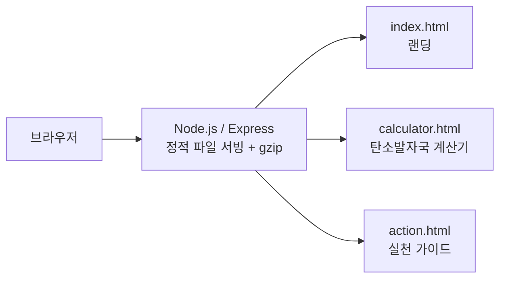

# CAU Green Campus Action

탄소발자국을 계산하고 중앙대학교 캠퍼스 안에서 실천할 수 있는 방법을 안내하는 웹 플랫폼.

## 개요

- 목적: 기후위기를 개인 일상의 수치로 보여주고, 캠퍼스 친환경 시설·프로그램과 연결
- 대회·수업명: 2025 생성형 AI 모델 활용 경진대회 2부 (이전 README 기준)
- 기간: (작성 예정)

## 시스템 구성



서버는 정적 파일 제공과 압축만 담당하고, 계산 로직은 브라우저에서 동작합니다.

## 기술 스택

**하드웨어**

- 해당 없음 (웹 전용)

**소프트웨어**

- Node.js 18 이상
- Express 4, `compression`
- 프런트엔드: 정적 HTML/CSS/JavaScript

**서버·인프라**

- 데이터베이스 없음. 외부 API 연동 코드 없음
- 원격 저장소: `https://github.com/boongbang0425/CAU.git` (`package.json` 기준)

## 폴더 구조

```text
cau-green-campus/
├─ public/
│  ├─ index.html        랜딩
│  ├─ calculator.html   탄소발자국 계산기
│  └─ action.html       실천 가이드
├─ server.js            정적 서버
├─ package.json
└─ docs/                이전 README
```

## 실행 방법

필요 버전: Node.js 18 이상

```bash
npm install
npm start        # 또는 npm run dev (nodemon)
```

환경변수나 설정 샘플 파일은 필요하지 않습니다.

## 팀 구성 및 내 역할

(작성 예정)

## 결과

(작성 예정)

## 알려진 제한

- 이전 README는 "AI 기반 분석"을 내세우지만, 저장소 안에 AI 모델 호출 코드나 API 연동은 없습니다. 계산기는 클라이언트 측 정적 로직입니다.
- `package-lock.json`이 없어 의존성 버전이 고정되지 않습니다.
- 테스트 코드가 없습니다 (`npm test`는 항상 성공을 반환).
