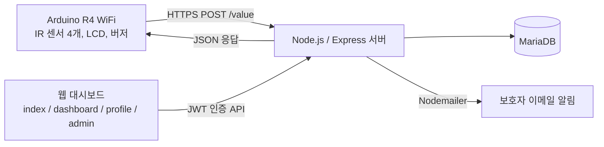

# COSS 스마트 약통

IR 센서로 약통 슬롯 개폐를 감지해 복약 여부를 기록하고, 미복약 시 보호자에게 이메일로 알리는 시스템.

## 개요

- 목적: 복약 이행을 자동으로 기록하고 누락 시 보호자에게 알림
- 대회·수업명: (작성 예정)
- 기간: (작성 예정)

## 시스템 구성



데이터 흐름

1. IR 센서가 약통 슬롯(아침·점심·저녁·취침 4칸)의 개폐를 감지
2. Arduino가 WiFi로 서버에 센서 데이터 전송
3. 서버가 디바운싱·플리커링 필터를 거쳐 복약 기록 생성
4. 웹 대시보드에서 복약 상태 확인
5. 미복약 시 보호자에게 이메일 발송

## 기술 스택

**하드웨어**

- Arduino R4 WiFi (WiFi 통신 및 제어)
- IR 센서 4개 (슬롯별 개폐 감지)
- LCD 16x2, 버저

**소프트웨어**

- Node.js 18 이상, Express 4
- 인증: `jsonwebtoken`, `bcryptjs`
- 메일: `nodemailer`
- 프런트엔드: 정적 HTML/CSS/JS (`public/`)

**서버·인프라**

- MariaDB (`mariadb` 드라이버)
- Cloudtype 배포 (이전 README 기준)
- 설정: `dotenv`

## 폴더 구조

```text
coss-contest-medibox/
├─ public/          정적 웹 페이지 (index, dashboard, profile, admin)
├─ server.js        Express 서버 + API
├─ package.json
└─ docs/            이전 README
```

## 실행 방법

필요 버전: Node.js 18 이상

```bash
npm install

# 환경변수 파일을 직접 만들어야 합니다 (샘플 파일 없음)
# 필요한 키는 server.js 에서 확인하십시오
cp .env.example .env   # .env.example 은 현재 저장소에 없습니다

npm start        # 또는 npm run dev (nodemon)
```

`server.js`는 실행 중 `coss-data.json`을 로컬에 생성합니다. 이 파일에는 사용자 계정과 복약 기록이 들어가므로 `.gitignore`에 추가해 두었습니다.

## 팀 구성 및 내 역할

이전 README에 하드웨어 설계·Arduino 펌웨어 담당자가 표로 있었습니다. 이름과 내 역할은 확인이 필요합니다.

(작성 예정)

## 결과

(작성 예정)

## 알려진 제한

- **Arduino 펌웨어 소스가 저장소에 없습니다.** 이전 README는 `MyArduinoCode.c`와 `arduino/` 경로를 언급하지만 실제 파일이 없습니다.
- `.env.example`이 없어 필요한 환경변수를 문서만으로는 알 수 없습니다.
- DB 스키마 정의 파일(마이그레이션/SQL)이 없습니다.
- 테스트 코드가 없습니다.
