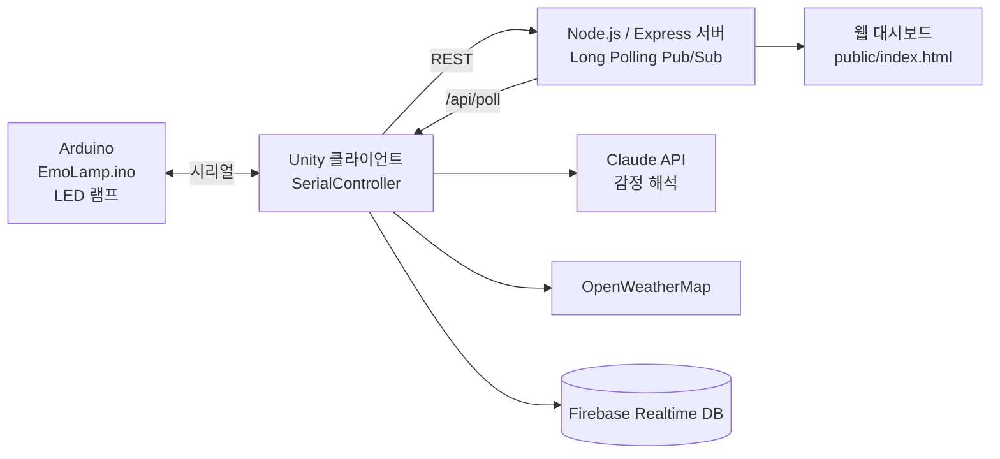

# EmoLamp 디지털 트윈

감정에 따라 색이 바뀌는 LED 램프와, 그 상태를 Unity 3D 화면에 실시간으로 반영하는 디지털 트윈.

## 개요

- 목적: 실물 램프(Arduino)와 Unity 가상 램프의 상태를 서버를 통해 양방향으로 동기화
- 대회·수업명: (작성 예정)
- 기간: (작성 예정)

## 시스템 구성



서버 API (이전 README 기준)

| Method | Endpoint | 설명 |
|---|---|---|
| GET | `/api/status` | 서버 상태 |
| GET / POST | `/api/state` | 램프 상태 조회·갱신 |
| POST | `/api/publish` | 메시지 발행 |
| GET | `/api/poll` | 메시지 폴링 |
| POST | `/api/led` | LED 색상 직접 제어 |
| GET | `/healthz` | 헬스 체크 |

## 기술 스택

**하드웨어**

- Arduino (스케치 `arduino/EmoLamp/EmoLamp.ino`)
- LED 램프

**소프트웨어**

- Unity 2022.3.62f3
- C# 스크립트: `ClaudeManager`, `WeatherManager`, `FirebaseManager`, `MQTTManager`, `SerialController`, `LampController`, `HSVController`, `BackgroundController`, `UIManager`
- TextMesh Pro

**서버·인프라**

- Node.js 18 이상, Express 4, `cors`, `dotenv`
- Firebase Realtime Database
- Cloudtype 배포 (이전 README 기준)
- 외부 API: Claude, OpenWeatherMap, Papago

## 폴더 구조

```text
digitaltwin-emolamp/
├─ unity/              Unity 프로젝트 (Assets, Packages, ProjectSettings)
├─ server/             Node.js 서버 (server.js, package.json, public/, .env.example)
├─ arduino/EmoLamp/    Arduino 스케치
└─ docs/               설치·회로·테스트 가이드, 이전 README
```

## 실행 방법

**서버**

```bash
cd server
npm install
cp .env.example .env     # 값을 채웁니다
npm start                # 또는 npm run dev
```

**Unity**

필요 버전: **Unity 2022.3.62f3**

1. `unity/` 폴더를 Unity Hub에서 엽니다.
2. 설정 파일을 만듭니다.

```bash
cd unity/Assets/StreamingAssets
cp config.sample.json config.json
# config.json 에 발급받은 키를 넣습니다. 이 파일은 .gitignore 대상입니다.
```

**Arduino**

`arduino/EmoLamp/EmoLamp.ino`를 Arduino IDE에서 열어 업로드합니다. 회로는 `docs/3_회로가이드.md` 참조.

## 팀 구성 및 내 역할

`server/package.json`의 author는 "Team 16"입니다. 구성원과 내 역할은 (작성 예정).

## 결과

(작성 예정)

## 알려진 제한

- **정리 작업이 중단된 상태입니다.** `unity/Assets/Scenes/Main.unity`에 API 키가 직렬화되어 있어 git 초기화를 진행하지 않았습니다. 아래 "보안" 항목을 먼저 처리해야 합니다.
- `unity/Assets/config.json`과 `unity/Assets/StreamingAssets/config.json`이 따로 있습니다. 전자는 5개 키, 후자는 8개 키로 **내용이 다릅니다.** 어느 쪽 코드도 이 파일을 읽지 않습니다.
- C# 코드에 `config.json`을 읽는 경로가 없습니다. API 키는 `[SerializeField]` 필드로 인스펙터에서 설정하는 구조라 씬 파일에 값이 저장됩니다.
- `unity/Assets/Arduino.meta`, `unity/Assets/Prefabs.meta`가 짝 없는 `.meta`로 남아 있습니다.
- 테스트 코드가 없습니다.

### 보안 (선행 처리 필요)

| 위치 | 내용 |
|---|---|
| `unity/Assets/Scenes/Main.unity:2054` | `apiKey` 필드에 32자 hex 키가 직렬화됨 |
| `unity/Assets/Scenes/Main.unity:2271` | `databaseUrl` 필드에 Firebase 엔드포인트 |
| `unity/Assets/config.json` | 실키 5종 |
| `unity/Assets/StreamingAssets/config.json` | 실키 8종 |

`.gitignore`가 `config.json`을 제외하므로 JSON 두 개는 커밋되지 않지만, **씬 파일은 제외할 수 없습니다.**
키를 폐기·재발급한 뒤 Unity 인스펙터에서 해당 필드를 비우고, 런타임에 설정 파일로 주입하도록 코드를 고쳐야 합니다.
