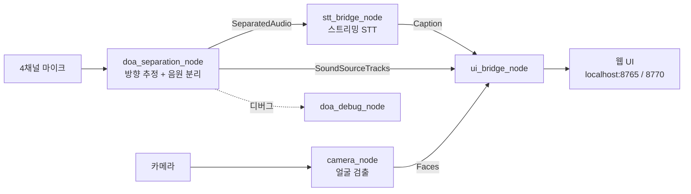

# Embedded Realtime Caption

4채널 마이크로 음원 방향을 추정하고 특정 방향의 음성만 분리해 한국어 실시간 자막을 만드는 임베디드 시스템.

## 개요

- 목적: 여러 화자가 섞인 환경에서 원하는 방향의 음성만 골라내어 실시간 한국어 자막을 제공
- 대회·수업명: (작성 예정)
- 기간: (작성 예정)

처리 파이프라인은 다음과 같습니다.

```text
4채널 마이크 → DOA(방향 추정) → Beamforming/음원 분리 → Streaming STT → 한국어 자막
```

## 시스템 구성



ROS 2 토픽 메시지는 `captioning_msgs` 패키지에 정의되어 있습니다.

| 메시지 | 용도 |
|---|---|
| `SoundSourceTrack` / `SoundSourceTracks` | 추정된 음원 방향 트랙 |
| `SeparatedAudio` | 분리된 단일 화자 오디오 |
| `Face` / `Faces` | 검출된 얼굴 위치 |
| `Caption` | 생성된 자막 텍스트 |

## 기술 스택

**하드웨어**

- Jetson Orin Nano
- 4채널 마이크 어레이
- 카메라 (얼굴 검출용)

**소프트웨어**

- ROS 2 Humble
- Python 3 (`rclpy`, `numpy`, `scipy`)
- 음원 분리 모델: Mamba 블록 기반 스트리밍 네트워크 (`model/mamba_block.py`, `net_v3.py`, `streaming_net.py`, `tracker.py`)
- 얼굴 검출: BlazeFace short range (`blaze_face_short_range.tflite`)
- 자막 UI: HTML/CSS/JavaScript (`jetson_ui/ui/`)

**서버·인프라**

- 로컬 실행 전용. 웹 UI를 `localhost:8765`, `localhost:8770`으로 제공

## 폴더 구조

```text
esw-contest-ieum/
├─ docs/                         브랜치 운영 규칙, 이전 README
└─ proj_main/
   ├─ bin/proj                   실행 스크립트 (start / ui / stop / rec)
   └─ ros2_ws/src/
      ├─ captioning_msgs/        커스텀 ROS 2 메시지 정의
      ├─ camera_node/            카메라 입력 + 얼굴 검출
      ├─ doa_separation_node/    방향 추정 + 음원 분리 (모델·가중치 포함)
      ├─ doa_debug_node/         DOA 디버그 시각화
      ├─ stt_bridge_node/        스트리밍 한국어 STT
      └─ ui_bridge_node/         자막 웹 UI 브리지
```

## 실행 방법

필요 환경: Jetson Orin Nano, Ubuntu + ROS 2 Humble

```bash
cd proj_main/ros2_ws
colcon build --symlink-install
source install/setup.bash

proj start
proj ui        # 웹 UI 열기
proj stop
proj rec       # 녹화
```

런타임 인자 예시:

```bash
proj start activity_threshold:=0.3 yaw_offset_deg:=11.6
```

분리 모델 가중치는 `ros2_ws/src/doa_separation_node/weights/jointnet_v4.pt`에 포함되어 있습니다.

설정 샘플 파일은 없습니다. 파라미터는 launch 인자로 전달합니다.

## 팀 구성 및 내 역할

`docs/README_old.md`의 브랜치 규칙 기준으로 담당자는 3명입니다.

| 담당 브랜치 | 담당 영역 |
|---|---|
| `feature/junhyeong` | DOA, Beamforming, Jetson 연동 |
| `feature/dongmin` | Streaming Korean STT |
| `feature/byunghyun` | (작성 예정) |

내 역할: (작성 예정)

## 결과

(작성 예정)

## 알려진 제한

- 기간, 대회명, 성과는 저장소 안에서 확인할 수 없어 비워 두었습니다.
- `bin/proj`는 `$HOME/proj_main`을 기준 경로로 하드코딩합니다. 다른 위치에 두면 수정이 필요합니다.
- `.gitignore`가 `models/`, `*.pt`, `*.onnx`를 제외하지만 `doa_separation_node/weights/jointnet_v4.pt`와 `camera_node/models/blaze_face_short_range.tflite`는 패턴에 걸리지 않아 커밋 대상입니다.
- 테스트 코드가 없어 자동 검증 결과를 제시할 수 없습니다.
