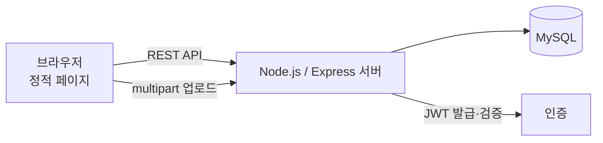

# FoodSave

남는 음식을 등록하고 필요한 사람이 예약·수령하도록 연결하는 푸드 쉐어링 웹 서비스.

## 개요

- 목적: 버려지는 음식을 줄이고 기부자와 수령자를 연결
- 대회·수업명: (작성 예정)
- 기간: (작성 예정)

사용자 유형은 기부자, 수령자, 봉사자·단체 셋으로 구분합니다.

## 시스템 구성



주요 화면

| 페이지 | 역할 |
|---|---|
| `index.html` | 랜딩 |
| `donations.html`, `donation-detail.html` | 기부 목록·상세 |
| `dashboard.html` | 대시보드 |
| `profile.html` | 프로필 |
| `info.html`, `mediaart.html` | 소개·미디어 |

## 기술 스택

**하드웨어**

- 해당 없음 (웹 전용)

**소프트웨어**

- Node.js, Express 4
- 인증: `jsonwebtoken`, `bcryptjs`
- 파일 업로드: `multer`
- 프런트엔드: 정적 HTML/CSS/JS (`public/`)

**서버·인프라**

- MySQL (`mysql2` 드라이버)
- 설정: `dotenv`
- Cloudtype 배포 (이전 README 기준)

## 폴더 구조

```text
food-save-web/
├─ public/          정적 페이지와 클라이언트 스크립트
│  ├─ app.js, donations.js
│  └─ styles.css, additional-styles.css, fixes.css
├─ logo/            로고 이미지
├─ server.js        Express 서버 + API
├─ package.json
└─ docs/            이전 README
```

## 실행 방법

필요 버전: Node.js 18 이상 권장 (`package.json`에 engines 명시는 없음)

```bash
npm install

# 환경변수 파일을 직접 만들어야 합니다 (샘플 파일 없음)
# 필요한 키는 server.js 에서 확인하십시오

npm start        # 또는 npm run dev (nodemon)
```

## 팀 구성 및 내 역할

(작성 예정)

## 결과

(작성 예정)

## 알려진 제한

- `.env.example`이 없어 필요한 환경변수를 문서만으로는 알 수 없습니다.
- DB 스키마 정의 파일(마이그레이션/SQL)이 없습니다.
- `package.json`의 `test` 스크립트가 실패를 반환하도록 되어 있습니다. 테스트 코드가 없습니다.
- 이전 README에 적힌 배포 링크의 동작 여부는 확인하지 않았습니다.
